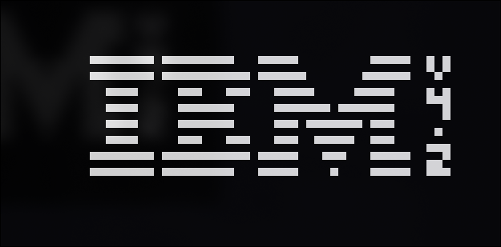

# chip8-emu

A CHIP-8 emulator written in C++17 with SDL2. 

## Build & Run

### Requirements
- C++17 compiler
- CMake 3.16+
- SDL2

### Instructions
```bash
mkdir -p build && cd build
cmake ..
cd ..
cmake --build build
./build/chip8-emu <rom>
```

## Architecture

The emulator is split into independent modules (Memory, CPU, Display, Input, Renderer), each owning its own state. The CPU only communicates with the rest through well-defined interfaces, keeping the decode-execute loop clean.

This implementation follows the SCHIP/CHIP-48 behavior for the ambiguous instructions: `8XY6`/`8XYE` shift VX in place (ignoring VY), and `FX55`/`FX65` do not increment the I register. See [Tobias V. Langhoff's guide](https://tobiasvl.github.io/blog/write-a-chip-8-emulator/) for details on these quirks.

## Controls
```
CHIP-8    Keyboard
1 2 3 C    1 2 3 4
4 5 6 D    Q W E R
7 8 9 E    A S D F
A 0 B F    Z X C V
```

## Screenshot



## References

- [Guide to making a CHIP-8 emulator](https://tobiasvl.github.io/blog/write-a-chip-8-emulator/) - Tobias V. Langhoff
- [CHIP-8 Test Suite](https://github.com/Timendus/chip8-test-suite) - Timendus
